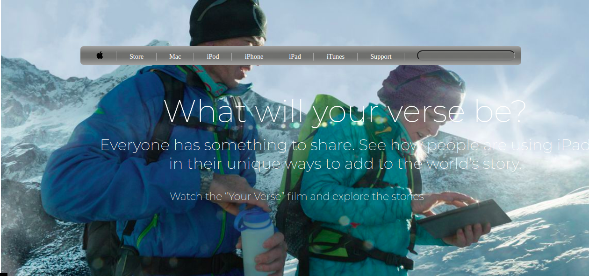

# Old Apple Page

> We are Microverse students doing some basic HTML and CSS project. We created a basic HTML Structure based on the pld Apple Page.

We created a nav-bar with the Apple logo and links to the site, we a gris with one row and 4 columns for the pictures below the main section, at the footer we added 3 divided divs section for the copyrights and policies. 

## Built With

- HTML
- CSS

## Live Demo

[Live Demo Link](https://rawcdn.githack.com/julian3493/old-apple-page/655e5be44cf03251238c4bf5080cea9654a351ad/index.html)

## Getting Started

To get a local copy up and running follow these simple example steps.

Clone the project repository by typing the command below

- git clone https://github.com/julian3493/old-apple-page/

After that enter on the directory of the cloned repository
- cd Positioning-and-Floating-Elements

To see how it looks like open the index.html file on your browser

## Authors

👤 **Julián**

- GitHub: [@julian3493](https://github.com/julian3493)
- Twitter: [@JulianR16893833](https://twitter.com/JulianR16893833)
- LinkedIn: [LinkedIn](https://www.linkedin.com/in/juli%C3%A1n-ricardo-ramos-arevalo-3868ba135/)

👤 **Juan Andres**

- GitHub: [@jarfsoft](https://github.com/jarfsoft)
- Twitter: [@jarfsoft](https://twitter.com/jarfsoft)
- LinkedIn: [LinkedIn](https://www.linkedin.com/in/juan-raudales-flores-7b0a3b113/)

## 🤝 Contributing

Contributions, issues, and feature requests are welcome!

Feel free to check the [issues page](https://github.com/julian3493/old-apple-page/issues).

## Show your support

Give a ⭐️ if you like this project!

## Acknowledgments

We thank all the sites below where we have found lots of meaningful content

- Apple
- W3Schools
